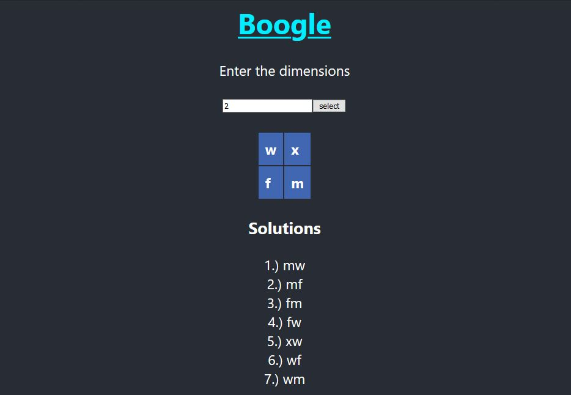

# boggle

## Execution

Open the folder boggle 
The node modules are not present within the code, please install it by using the command `npm install react`. 
Run the app in development mode by using `npm start`. 
Open [http://localhost:3000](http://localhost:3000) to view it in the browser. 

The whole assignment is also available in [github-abheysujith](put github link) . 
The program was made with node and react (used visual code as editor). 

### Files in src

`App.js`  
`App.css`  
`algorithm.js`  

### `App.js`

This file contains the code for the react page. 
The React page takes input the size n of the boggle board and using this a random n x n board is created and the solution is displayed.  

### `App.css`

Contains css script for div,h1 and the board.

### `algorithm.js`

Contains the algorithm for making the trie(digital tree) using dictionary and using this trie and depth first search to find the words in the board. 
